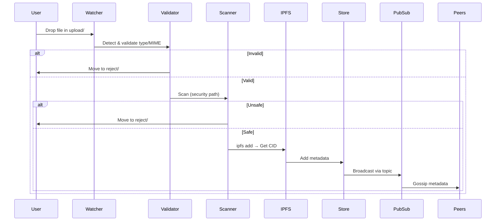
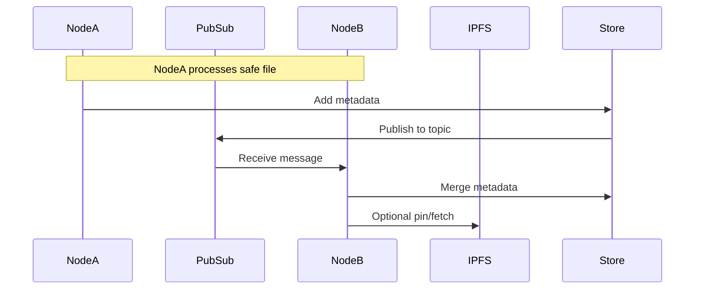

# PinShare Architecture Documentation

## Overview

PinShare is a decentralized pinning service for IPFS, enabling secure file sharing via libp2p. It processes files dropped into a watched directory, validates and scans them for security, generates IPFS CIDs, stores metadata, and propagates it via PubSub to peers. The system includes a CLI for management, a REST API for interactions, and configurable security paths (P2P-Sec, VT API, ClamAV, VT Web Scraping).

Key goals:
- Secure file curation for libraries/knowledge stacks.
- P2P metadata sharing without direct file transfer (peers fetch from IPFS).
- Customizable for different communities via config.

No graphical UI; interactions via CLI and API. Core app logic in `internal/app`, with modular internals for P2P, store, security (psfs), config, and cmd.

## Components

### App Core (`internal/app`)
- Orchestrates startup: Loads config, checks dependencies, sets up libp2p host, file watcher, API server, banset routine.
- Handles graceful shutdown, saving store.
- Provided by: Core app code.

### Configuration (`internal/config`)
- YAML-based: Folders (upload/cache/reject/metadata), ports, topic ID, security capability, feature flags.
- Loaded at startup to guide behavior.
- Provided by: Core app code.

### CLI (`internal/cmd`)
- Cobra-based root command with subcommands (e.g., test chromedp, store ops).
- For testing/debugging; main run starts service if no subcommand.
- Provided by: Core app code + Cobra dep.

### P2P Networking (`internal/p2p`)
- libp2p host with DHT (Kademlia), PubSub for metadata gossip, direct messaging.
- Bootstrap to default peers; NAT traversal, relay support.
- PubSubManager handles topic subscription, message processing (add/update metadata), periodic publishing.
- Features: Peer connection, status, messaging via API.
- Provided by: Core app code + libp2p deps (go-libp2p, go-libp2p-kad-dht, go-libp2p-pubsub).

### Metadata Store (`internal/store`)
- JSON file-based CRDT-like store: BaseMetadata (SHA256, CID, type, timestamps), tags, votes, banset.
- Operations: Add/update files/tags, vote (up/down for removal/tags), ban, list/get.
- Loaded/saved on startup/shutdown; used by API and PubSub.
- Provided by: Core app code.

### File Processing & Security (`internal/psfs`)
- File watcher scans upload folder periodically.
- Validation: Allowed types (configurable), MIME type check.
- Security scans (capability-based):
  - Path 1: P2P-Sec service (port 36939).
  - Path 2: VirusTotal API (env VT_TOKEN).
  - Path 3: ClamAV local scan (freshclam update).
  - Path 4: VirusTotal web scraping (chromedp headless Chrome).
- IPFS integration: Add file to get CID, pin/unpin via CLI commands.
- Moves safe files to cache, rejects to reject folder; broadcasts metadata if safe.
- Provided by: Core app code + deps (chromedp, IPFS CLI via bash, ClamAV).

### API (`internal/api`)
- OpenAPI spec-generated REST server (port auto-increment from 9090).
- Endpoints: Files (list/get/add/update), tags (add/remove), votes, P2P (peers/list/connect/message/status), metrics (/metrics Prometheus).
- Integrates store and P2P host.
- Provided by: Core app code + deps (kin-openapi, oapi-codegen/runtime, Prometheus).

### Dependencies vs App-Provided Features
- **App-Provided (Core Code):**
  - File watching/processing workflow.
  - Metadata store and CRDT ops.
  - Security orchestration (path selection, integration).
  - API handlers and OpenAPI spec.
  - CLI commands.
  - Banset routine (unpin voted-unsafe files).
  - Config management.

- **Dependencies-Provided:**
  - **libp2p Stack:** All P2P networking (host, DHT discovery, PubSub gossip, direct streams, NAT/relay).
  - **IPFS Tools:** File adding/pinning/unpinning (via external CLI; no embedded node).
  - **chromedp:** Headless browser for VT web scraping.
  - **ClamAV:** Local AV scanning.
  - **Cobra:** CLI framework.
  - **OpenAPI Tools:** API generation/validation.
  - **Prometheus:** Metrics exposure (libp2p + custom potential).

No external UI; API can integrate with custom frontends. Dev code (`internal/dev_code`) for chunking experiments, not production.

## Data Flow

1. **Startup:** Load config → Check deps/security path → Create folders → Load store → Init libp2p host/DHT/PubSub → Start watcher/API/banset.
2. **File Ingestion:** Watcher detects file → Validate type/MIME → Scan security → If safe: IPFS add → Get CID → Store metadata → PubSub broadcast.
3. **Peer Interaction:** Subscribe to topic → Receive metadata → Fetch/pin from IPFS if desired → Vote/tag via API/store → Propagate changes.
4. **Management:** API/CLI for queries/updates; periodic status logs.

## Diagrams

### Component Diagram

```mermaid
graph TD
    subgraph "PinShare App"
        CLI[CLI (Cobra)]
        AppCore[App Core<br/>Watcher, Orchestration]
        Config[Config (YAML)]
        Store[Metadata Store<br/>(JSON CRDT)]
        API[REST API<br/>(OpenAPI)]
    end

    subgraph "P2P Network"
        Libp2p[libp2p Host<br/>DHT, PubSub, DM]
        Peers[Connected Peers]
    end

    subgraph "File Processing"
        Watcher[File Watcher]
        Validator[Type/MIME Validator]
        Scanner[Security Scanner<br/>(Paths 1-4)]
        IPFS[IPFS CLI<br/>Add/Pin]
    end

    subgraph "External Deps"
        VT[VirusTotal<br/>(API/Web)]
        Clam[ClamAV Local]
        Chrome[Headless Chrome<br/>(chromedp)]
        IPFSNode[IPFS Daemon]
    end

    CLI --> AppCore
    AppCore --> Config
    AppCore --> Store
    AppCore --> Libp2p
    AppCore --> Watcher
    AppCore --> API

    Watcher --> Validator
    Validator --> Scanner
    Scanner --> VT
    Scanner --> Clam
    Scanner --> Chrome
    Scanner -->|Safe| IPFS
    IPFS --> Store
    Store --> Libp2p
    Libp2p <--> Peers
    API <--> Store
    API <--> Libp2p
    IPFSNode -.-> IPFS
```

### File Processing Sequence



### P2P Metadata Propagation



For more details, see `docs/planning/todo.md` for ongoing features and `README.md` for usage.