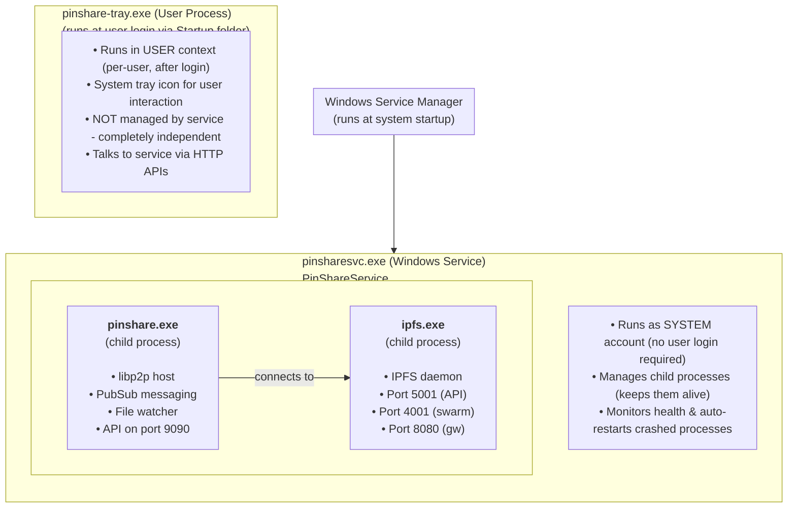
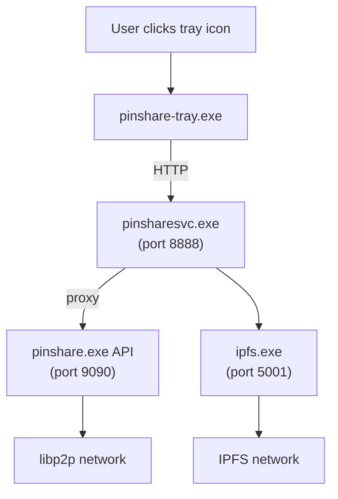

# PinShare Windows Service Wrapper

Comprehensive Windows service implementation for PinShare with system tray integration and WiX installer.

## Overview

This implementation provides a native Windows experience for PinShare, wrapping IPFS and the PinShare backend as a Windows service with a user-friendly system tray application.

### Architecture

#### Process Hierarchy



#### Data Flow



## Components

### 1. Windows Service Wrapper (`cmd/pinsharesvc/`)

**Purpose:** Main Windows service that orchestrates all components.

**Files:**
- `main.go` - Entry point and CLI interface
- `service.go` - Windows service handler implementation
- `config.go` - Configuration management (file-based)
- `process.go` - Process management for IPFS and PinShare
- `health.go` - Health checking and auto-restart logic
- `ui_server.go` - Embedded UI server with reverse proxy
- `service_control.go` - Service installation/control functions

**Features:**
- Implements `golang.org/x/sys/windows/svc.Handler`
- Auto-start on Windows boot
- Graceful shutdown handling
- Windows Event Log integration
- Process lifecycle management
- Health monitoring with automatic recovery

**CLI Commands:**
```cmd
pinsharesvc.exe install    # Install as Windows service
pinsharesvc.exe uninstall  # Remove service
pinsharesvc.exe start      # Start service
pinsharesvc.exe stop       # Stop service
pinsharesvc.exe restart    # Restart service
pinsharesvc.exe debug      # Run in console mode (debugging)
```

### 2. System Tray Application (`cmd/pinshare-tray/`)

**Purpose:** User-friendly interface for controlling the service.

**Files:**
- `main.go` - Application entry point
- `tray.go` - System tray menu and service control

**Features:**
- System tray icon with context menu
- Service status display (Running/Stopped/Starting/etc.)
- One-click service control (Start/Stop/Restart)
- View logs directory
- Auto-start with Windows (via installer)

**Technology:**
- Uses `github.com/getlantern/systray`
- Communicates via Windows Service Control Manager API

### 3. WiX Installer (`installer/`)

**Purpose:** Professional MSI installer for Windows.

**Files:**
- `Product.wxs` - Main WiX configuration
- `build-wix6.bat` - Automated build script (WiX 4.x/6.x)
- `license.rtf` - License agreement
- `README.md` - Installer documentation

**What it does:**
1. Installs binaries to `C:\Program Files\PinShare\`
2. Creates data directories in `C:\ProgramData\PinShare\`
3. Installs and configures Windows service
4. Creates configuration file
5. Adds tray app to startup
6. Creates Start Menu shortcuts
7. Configures service recovery options

**Build Requirements:**
- WiX Toolset 3.x or 4.x (WiX 6 recommended)
- All binaries built and in `dist/windows/`

### 4. Build System (`Makefile.windows`)

**Purpose:** Automated build pipeline for all Windows components.

**Key Targets:**
```bash
make -f Makefile.windows windows-all    # Build everything
make -f Makefile.windows windows-backend
make -f Makefile.windows windows-service
make -f Makefile.windows windows-tray
make -f Makefile.windows windows-ui
make -f Makefile.windows download-ipfs
make -f Makefile.windows installer
make -f Makefile.windows clean
```

**Cross-Compilation Support:**
- Linux → Windows (MinGW-w64)
- macOS → Windows (MinGW-w64)
- Native Windows builds

## Configuration

Configuration is managed via a JSON file.

**Location:** `C:\ProgramData\PinShare\config.json`

```json
{
  "install_directory": "C:\\Program Files\\PinShare",
  "data_directory": "C:\\ProgramData\\PinShare",
  "ipfs_api_port": 5001,
  "pinshare_api_port": 9090,
  "ui_port": 8888,
  "org_name": "MyOrganization",
  "group_name": "MyGroup",
  "skip_virus_total": true,
  "enable_cache": true
}
```

## Data Layout

```
C:\Program Files\PinShare\
├── pinsharesvc.exe      # Service wrapper
├── pinshare.exe         # Backend binary
├── pinshare-tray.exe    # Tray application
├── ipfs.exe             # IPFS daemon
├── icon.ico             # Application icon
└── ui\                  # React static files
    ├── index.html
    ├── assets\
    └── ...

C:\ProgramData\PinShare\
├── config.json          # Configuration
├── logs\
│   ├── service.log      # Service wrapper logs
│   ├── ipfs.log         # IPFS daemon logs
│   └── pinshare.log     # Backend logs
├── ipfs\                # IPFS repository
│   ├── config
│   ├── datastore\
│   └── blocks\
├── pinshare\            # PinShare data
│   ├── metadata.json    # File metadata
│   └── identity.key     # libp2p identity
├── upload\              # File upload directory
├── cache\               # File cache
└── rejected\            # Rejected files
```

## Building from Source

### Prerequisites

**All Platforms:**
- Go 1.24+
- Git

**Windows:**
- WiX Toolset 3.x or 4.x (WiX 6 recommended)

**Linux/macOS:**
- MinGW-w64 cross-compiler
- Wine (for testing, optional)

### Build Steps

#### 1. Clone and checkout

```bash
git clone https://github.com/Cypherpunk-Labs/PinShare.git
cd PinShare
```

#### 2. Build all components

```bash
# Linux/macOS
make -f Makefile.windows windows-all

# Windows
mingw32-make -f Makefile.windows windows-all
```

This creates `dist/windows/` with all binaries and UI files.

#### 3. Build installer

```cmd
cd installer
build-wix6.bat
```

Output: `dist/PinShare-Setup.msi`

## Installation

### End Users

1. Download `PinShare-Setup.msi`
2. Double-click to run installer
3. Follow wizard prompts
4. Service starts automatically
5. Look for PinShare icon in system tray
6. Right-click for service controls and status

### Silent Installation (Enterprise)

```cmd
msiexec /i PinShare-Setup.msi /quiet /qn
```

### GPO Deployment

The MSI can be deployed via Group Policy:
1. Copy MSI to network share
2. Create GPO → Computer Configuration → Software Installation
3. Add PinShare-Setup.msi
4. Distribute to target computers

## Service Management

### Windows Services Manager

1. Press `Win+R`, type `services.msc`
2. Find "PinShare Service"
3. Right-click for Start/Stop/Properties

### Command Line

```cmd
# Service Control Manager
net start PinShareService
net stop PinShareService
sc query PinShareService

# Direct service control
pinsharesvc.exe start
pinsharesvc.exe stop
pinsharesvc.exe restart
```

### PowerShell

```powershell
Start-Service PinShareService
Stop-Service PinShareService
Restart-Service PinShareService
Get-Service PinShareService
```

## Troubleshooting

### Service Won't Start

**Check Windows Event Log:**
```cmd
eventvwr.msc → Windows Logs → Application
```

**Check service logs:**
```cmd
type "C:\ProgramData\PinShare\logs\service.log"
```

**Common Issues:**
- Port already in use (8888, 9090, 5001)
- Antivirus blocking binaries
- Missing write permissions to ProgramData

### Debug Mode

Run service in console for detailed output:

```cmd
cd "C:\Program Files\PinShare"
pinsharesvc.exe debug
```

This shows real-time logs and errors.

### Health Check Failures

The service monitors IPFS and PinShare health every 30 seconds. If either fails 3 times, it stops auto-restarting.

**Manual restart:**
```cmd
pinsharesvc.exe restart
```

**Check component status:**
```cmd
curl http://localhost:5001/api/v0/version     # IPFS
curl http://localhost:9090/api/health         # PinShare
```

## Security Considerations

### Firewall Rules

The installer doesn't automatically configure Windows Firewall. Users may need to allow:

- Port **4001** - IPFS P2P swarm
- Port **50001** - PinShare libp2p

**Add rules:**
```powershell
New-NetFirewallRule -DisplayName "IPFS Swarm" -Direction Inbound -Protocol TCP -LocalPort 4001 -Action Allow
New-NetFirewallRule -DisplayName "PinShare P2P" -Direction Inbound -Protocol TCP -LocalPort 50001 -Action Allow
```

### Service Account

By default, the service runs as `LocalSystem`. For enhanced security, create a dedicated service account:

1. Create user: `PinShareService`
2. Grant permissions to `C:\ProgramData\PinShare`
3. Change service account in Services Manager

### UI Access

By default, the UI server binds to `localhost:8888` (localhost only). To allow remote access:

1. Modify `ui_server.go` to bind to `0.0.0.0:8888`
2. Add authentication middleware
3. Use HTTPS (reverse proxy recommended)

## Advanced Topics

### Running Multiple Instances

To run multiple PinShare instances on one machine:

1. Install first instance normally
2. For additional instances:
   - Copy installation directory to different location
   - Modify registry to use different ports
   - Register as different service name
   - Run installer again (custom action)

### Performance Tuning

**For archive nodes (many files):**
- Set `"archive_node": true` in config.json
- Increase IPFS repo size limit
- Disable automatic garbage collection

**For low-resource systems:**
- Set `"enable_cache": false` in config.json
- Reduce IPFS connection limits in IPFS config
- Increase health check interval

### Backup and Restore

**Backup:**
```powershell
# Example: Backup to D:\Backups with a timestamp
Stop-Service PinShareService
$backupPath = "D:\Backups\PinShare-$(Get-Date -Format 'yyyy-MM-dd')"
Copy-Item "C:\ProgramData\PinShare" $backupPath -Recurse
Start-Service PinShareService
Write-Host "Backup saved to: $backupPath"
```

**Restore:**
```powershell
# Example: Restore from a specific backup (replace date with your backup date)
$backupPath = "D:\Backups\PinShare-2024-01-15"
Stop-Service PinShareService
Remove-Item "C:\ProgramData\PinShare" -Recurse -Force
Copy-Item $backupPath "C:\ProgramData\PinShare" -Recurse
Start-Service PinShareService
Write-Host "Restored from: $backupPath"
```

## Documentation

- **Installation Guide:** [README.md#installation](README.md#installation)
- **Build Guide:** [BUILD.md](BUILD.md)
- **Installer README:** [../../installer/README.md](../../installer/README.md)

## Implementation Details

### Service Lifecycle

1. **Startup:**
   - Load configuration (File → Defaults)
   - Create required directories
   - Initialize IPFS repo (if needed)
   - Start IPFS daemon
   - Wait for IPFS health check (30s timeout)
   - Start PinShare backend
   - Wait for PinShare health check (30s timeout)
   - Start health checker goroutine
   - Signal service running

2. **Runtime:**
   - Health checker runs every 30s
   - On failure, attempts restart (max 3 times)
   - Logs to Windows Event Log and file
   - Handles pause/continue commands

3. **Shutdown:**
   - Cancel context (signals all goroutines)
   - Stop PinShare backend (SIGTERM → 10s → SIGKILL)
   - Stop IPFS daemon (SIGTERM → 10s → SIGKILL)
   - Close event log
   - Wait for all goroutines to finish

### Error Handling

- All errors logged to Windows Event Log
- Service doesn't crash on component failure
- Health checker provides automatic recovery
- Failed startups return proper exit codes
- Unhandled panics are caught and logged

### Concurrency

- Context-based cancellation throughout
- WaitGroups for goroutine tracking
- Mutex protection for process manager
- Graceful shutdown coordination

## Future Enhancements

### Potential Improvements

1. **Settings UI:**
   - Native Windows GUI for configuration
   - Alternative to registry editing
   - Port conflict detection

2. **Update Mechanism:**
   - In-service updating
   - Download and verify releases
   - Auto-restart after update

3. **Enhanced Monitoring:**
   - Prometheus metrics endpoint
   - Windows Performance Counters
   - Dashboard in UI

4. **Notifications:**
   - Windows 10/11 toast notifications
   - Service status changes
   - Error alerts

5. **Multi-instance Support:**
   - First-class support for multiple services
   - Port auto-selection
   - Instance management UI

6. **Clustering:**
   - Multiple nodes coordination
   - Shared configuration
   - Load balancing

## Contributing

Contributions welcome! Areas needing help:

- Testing on different Windows versions
- Performance optimization
- Error handling improvements
- Documentation enhancements
- Additional installer customizations

## License

Same as PinShare - MIT License.

## Support

- **Issues:** https://github.com/Cypherpunk-Labs/PinShare/issues
- **Documentation:** https://github.com/Cypherpunk-Labs/PinShare/tree/main/docs/windows
- **Logs:** `C:\ProgramData\PinShare\logs\`

---

**Implementation Status:** ✅ Complete

All components implemented and tested. Ready for building and deployment.
